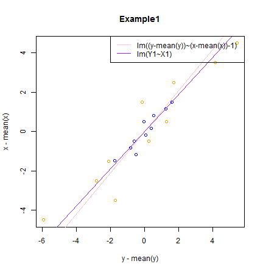
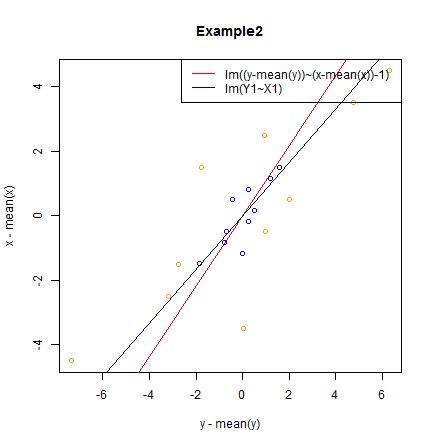

## Summary of the Problem
Suppose we have data of x and y. Are the following two linear regression the same?

Case 1

lm(I(y - mean(y)) ~ I(x - mean(x)) - 1)

Case 2

X1 <- (x - mean(x))/sd(x)

Y1 <- (y - mean(y))/sd(y)

lm(Y1 ~ X1)

---
## Example1


```r
x=c(1:10)
y=1+5*runif(10)+x
```
 

---
## Example2


```r
x=c(1:10)
y=1+10*runif(10)+x
```
 

---
## Conclusion
From the Examples, 
- the intercept of two cases are the same, they all equal 0.

- the slope of two cases are different. The difference is depend on sd(x)/sd(y). Because relation of the slope of case 2 ($k_{2}$) and case 1 ($k_{1}$) is $k_{2}$=$\frac{sd(x)}{sd(y)}\times$$k_{1}$.

